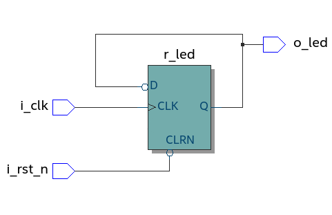

# TP_FPGA
Compte rendu des TPs de FPGA avec le projet quartus

Le but de ce TP est de se familiariser avec Quartus et d'utiliser nos compétences pour faire un écran magique. Dans un premier temps, on suit un tutoriel Quartus puis dans un deuxième temps, on se lance dans le projet écran Magic.

# TP Séance 1

## 1 - Création d'un projet 

On suit la démarche de création de projet

## 2 - Création d'un fichier VHDL

On suit la démarche de création d'un fichier

## 3 - Fichier de contraintes

On synthétise le projet et on attribue les pins.

## 4 - Compilation et programmation de la carte

10) 
Après avoir reprogrammé la carte, on remarque que le comportement de la LED est inversé. Il suffit de rajouter un "not" dans la ligne : led0 <= pushl; pour inverser le comportement inversé. 

On obtient : led0 <= not pushl;

## Faire clignoter une LED

1) En regardant dans le user manual, on voit que l'horloge nommée "FPGA_CLK1_50" est sur le pin : "PIN_V11"

3) On trace un schéma correspondant : 

11) Le "_n" dans "i_rst_n" signifie que l'entrée est inversé. Ce qui signifie que l'entrée est active à l'état bas. 

# TP Séance 2

