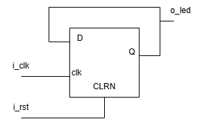
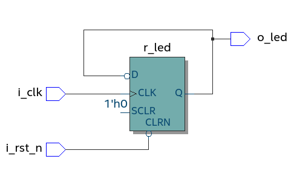
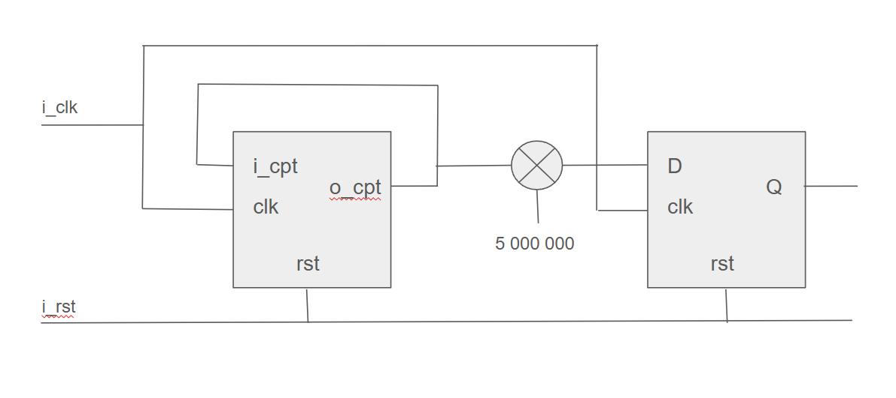
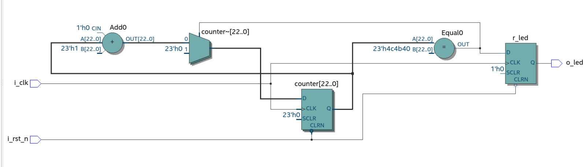
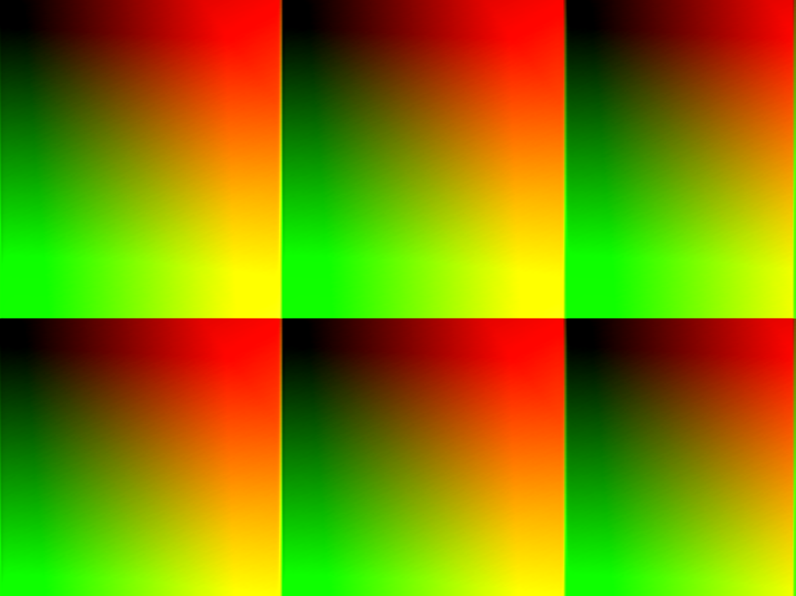
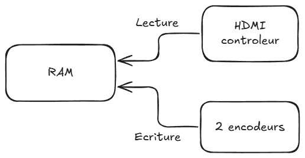
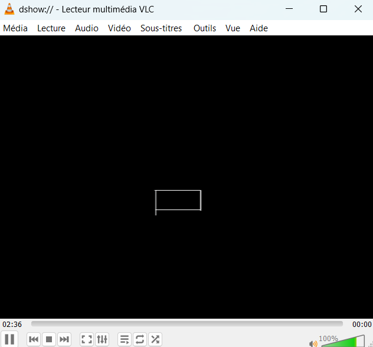

# TP_FPGA
Compte rendu des TPs de FPGA avec le projet quartus

Le but de ce TP est de se familiariser avec Quartus et d'utiliser nos compétences pour faire un écran magique. Dans un premier temps, on suit un tutoriel Quartus puis dans un deuxième temps, on se lance dans le projet écran Magic.

## 1 - Création d'un projet 

On suit la démarche de création de projet

## 2 - Création d'un fichier VHDL

On suit la démarche de création d'un fichier

## 3 - Fichier de contraintes

On synthétise le projet et on attribue les pins.

## 4 - Compilation et programmation de la carte

10) 
Après avoir reprogrammé la carte, on remarque que le comportement de la LED est inversé. Il suffit de rajouter un "not" dans la ligne : led0 <= pushl; pour inverser le comportement inversé. 

On obtient : led0 <= not pushl;

## Faire clignoter une LED

1) En regardant dans le user manual, on voit que l'horloge nommée "FPGA_CLK1_50" est sur le pin : "PIN_V11"

3) On trace un schéma correspondant : 

4) Le schéma proposé par quartus est

Pour générer le signal o_led qui fait clignoter la LED, on utilise une bascule D dont la sortie alterne entre 0 et 1 à la fréquence de l'horloge.
Notre schéma et celui proposé par quartus sont équivalents et reprennent le même fonctionnement.

7) En adaptant la fréquence, on a :

8) On a le nouveau schéma sur RTL Viewer:

On utilise un compteur pour diviser la fréquence 50Mhz en quelque chose de plus petit (ici notre compteur est sur 23 bits car cela permet de coder 5Mhz). La première bascule renvoie la valeur du compteur. Celle-ci est incrémenté en amont par l'opérateur Add0. En aval, on compare la valeur du comparateur avec 5 millions. Si c'est le cas, on change la valeur de la sortie o_led et on reinitialise le compteur avec le multiplexeur.
Pour comparer les schémas, le fonctionnement reste globalement le même sauf que le notre est une représentation plus conceptuelle.

11) Le "_n" dans "i_rst_n" signifie que l'entrée est inversé. Ce qui signifie que l'entrée est active à l'état bas. 

## 5 - Chenillard

On a codé le chenillard et on l'a validé.

# Petit projet : écran magique

## 1 - Gestion des encodeurs

2) 
La présence de deux bascules nous permet avec l'horloge d'avoir en mémoire 2 états à des moments différents : au moment où il y a un front montant au niveau de la bascule A, la bascule A sauvegarde l'état de l'entrée. La bascule B va sauvergarder cet état. Or si l'entrée change d'état entre temps, la bascule A et B auront des états différents.

On a alors un front

On peut détecter ce front avec un xor (la sortie vaut 1 si les entrées sont différentes).
On peut différencier un front montant d'un front descendant en faisant un not sur la sortie de la bascule B : si not(sortie) = 0 on a un front montant et sinon un front descendant.

Le code a été validé.

## 3 - Contrôleur HDMI

4) Pour implémenter le contrôleur HDMI, on crée un nouveau composant et on assigne ses entrées et sorties en suivant les directives du sujet.  

5) Après avoir fait les modifications nécessaire, on affiche :

Les bits qui correspondent au rouge sont les bits 23 à 16.

Les bits qui correspondent au vert sont les bits 15 à  8.

Les bits qui correspondent au bleu sont les bits 7 à 0 (tous mis à 0).

## 4 - Déplacement d'un pixel

Pour déplacer le pixel sur l'écran, dans un process, on regarde si la valeur des compteurs du contrôleur HDMI sont égales à la valeurs des encodeurs (les encodeurs et les compteurs sont à la même position sur l'écran). Dans ce cas, on met un pixel blanc sinon, on met un pixel noir. 

On a donc un pixel blanc sur la potition des encodeurs et un pixel noir partout ailleurs. 

A noter qu'il n'y a pas de limitations sur la valeurs des encodeurs. Ainsi, si l'un des encodeurs possède une valeur trop grande, le pixel sort de l'écran.

## 5 - Mémorisation

1) Une mémoire dual-port est une structure de mémoire qui comporte 2 canaux de communication qui peuvent tous les deux supporter l'écriture ou la lecture.

2) Voici un schéma pour le fonctionnement de la RAM:

3 et 4) On connecte le composants dpram créé à des signaux créé pour ce composant. Puis, pour écrire ou lire des données dans la RAM, on crée 2 process. 

Dans le premier, on écrit dans la ram la valeur "11111111" dans à l'adresse adresse = x_compteur_controleur_hdmi + y_compteur_controleur_hdmi * 720$. Ainsi, on stocke dans la RAM des "ligne" de $720*8$ bits correspondant aux lignes de l'écran (la ligne en y=0 de la RAM correspond à la ligne la plus huate de l'écran).  

Dans le second process, on lit en permanance les données stockées dans la RAM et on écrit cette valeur sur l'écran (en l'adaptant pour que l'octet de la RAM soit duppliqué 3 fois pour pouvoir être stocké sur une varaible de 24 bits). 

6) On a bien la mémorisation

## 6 - Effacement 

Pour l'effacement, on regarde si le push-button de l'encodeur gauche est appuyé. Si il n'est pas actionné, dans la partie lecture de la RAM, on lit l'adresse donnée par le contrôleur HDMI et on affiche cette valeur sur l'écran. Sinon, on réinitialise la RAM en écrivant des 0 et on affiche des pixels noirs sur l'écran.

A noter que l'effacement par du principe que la durée d'un appuie sur le bouton est plus long que la durée d'un rafraichissement de l'écran.

